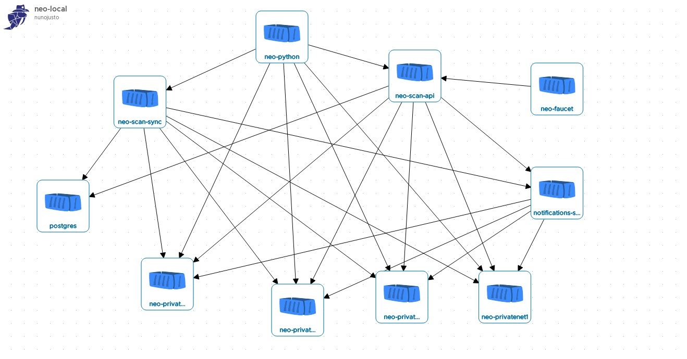

<p align="center">
  
</p>

<h1 align="center">neo-local</h1>

<p align="center">
  Personal private blockchain for NEO dApp development!
</p>


## Table of contents

- [Quick start](#quick-start)
- [What's included](#whats-included)
- [Usage](#usage)
- [Customizing](#customizing)
- [Tricks and tweaks](#tricks-and-tweaks)
- [Bugs and feature requests](#bugs-and-feature-requests)
- [license](#license)

## Quick start

Fast and easy to start from the ground:

- Install docker and docker-compose for your platform: 
    - Linux [Docker](https://store.docker.com/search?offering=community&operating_system=linux&q=&type=edition) - [docker-compose](https://docs.docker.com/compose/install/#install-compose)
    - Mac [Docker and docker-compose](https://docs.docker.com/docker-for-mac/install/)
    - Windows [Docker and docker-compose](https://docs.docker.com/docker-for-windows/install/)
- Download the latest version of [neo-local](https://github.com/CityOfZion/neo-local/archive/master.zip)
    - or clone the repo: `git clone https://github.com/CityOfZion/neo-local.git`
- Move to the folder neo-local
- Start all with the command `make start`
- Wait some seconds and you will have neo-python prompt available
- You can also start your browser and go to [neo-local-faucet](http://localhost:4002) and claim some NEO and GAS to a wallet

That will make a private NEO blockchain just for you to develop your dApp or smart-contract

To stop neo-local, exit from neo-python prompt and do the following command:
```
make stop
```

## What's included

Within the neo-local you'll find the following services:

- [neo-local-faucet](https://github.com/CityOfZion/neo-local-faucet) (dev faucet)
- [neo-cli](https://github.com/neo-project/neo-cli) (consensus nodes)
- [neo-python](https://github.com/CityOfZion/neo-python) (development CLI)
- [neo-scan-api](https://github.com/CityOfZion/neo-scan) (block explorer)
- [neo-scan-sync](https://github.com/CityOfZion/neo-scan) (block explorer)
- [postgres](https://hub.docker.com/_/postgres/) (database for neo-scan)



## Usage

After running neo-local (see [Quick start](#quick-start)) you will land in the neo-python prompt.<br>
Consensus nodes are available on `localhost` ports `20333`, `20334`, `20335` and `20336`.<br>
Or by RPC on `localhost` ports `30333`, `30334`, `30335` and `30336`.

There are also two folders shared with the neo-python running container. Everything you put there is available to be used inside the container.
```
neo-local/
├── wallets/
├── smart-contracts/
```

## Customizing

Four neo-cli consensus nodes are started as block producers. The version of those nodes can be customized by you.
You can start neo-local with a different or even all different versions at the same time.

To change the default versions you just need to edit the ".env" file
```
neo-local/
├── .env
```
and change the variables above
```
# neo-cli version
# Other supported versions: 2.9.0, 2.8.0, 2.7.6.1
NODE1_NEO_CLI_VERSION=2.8.0
NODE2_NEO_CLI_VERSION=2.7.6.1
NODE3_NEO_CLI_VERSION=2.8.0
NODE4_NEO_CLI_VERSION=2.9.0
```

## Tricks and tweaks

### Monitoring your nodes

If you want to monitor your consensus nodes, you can use this little script that makes two RPC calls querying the version of the node and the blockcount. It will keep looping and showing you the results in a table.
```
neo-local/
├── privnet/
│   ├── watch_nodes_sync.sh
```
Run it like this
```
./privnet/watch_nodes_sync.sh
```

### Changing a NEO node version while blockchain is running
And if you want to change a consensus node version when all is already running?<br>
Well, you can do that without disrupting your blockchain in a snap of time.<br>
To make that happen you need to run a script inside the privnet folder:
```
neo-local/
├── privnet/
│   ├── change_neo-cli_node_version.sh
```
The script accepts 2 arguments:

- The first is the name of the node container. There are four container names.<br>
Example: `neo-cli-privatenet-1` (that goes from 1 to 4 numbers)

- The second argument is the version of the neo-cli desired to be installed

This is a possible example:
```
./privnet/change_neo-cli_node_version.sh neo-cli-privatenet-3 2.9.0
```
Note: This works for upgrading or downgrading the version.

### Bootstrap a genesis clean chain

Sometimes is good to start fresh from the genesis block.<br>
You can do that changing the variables on the `.env` file

```
neo-local/
├── .env
```

Inside that file you have a variable called BOOTSTRAP.<br>
There are two possible values:<br>
- `_genesis` means starting from block zero
- `_4kBlocks` starts with 4000 blocks (default)

Note: A genesis chain doesn't have GAS claimed yet. You will need GAS to deploy smart-contracts.

## Bugs and feature requests

Have a bug or a feature request? Please first read the [issue guidelines](https://github.com/CityOfZion/neo-local/CONTRIBUTING.md) and search for existing and closed issues. If your problem or idea is not addressed yet, [please open a new issue](https://github.com/CityOfZion/neo-local/issues/new/choose).

## License

- Open-source [MIT](https://github.com/CityOfZion/neo-local/blob/master/LICENSE)
